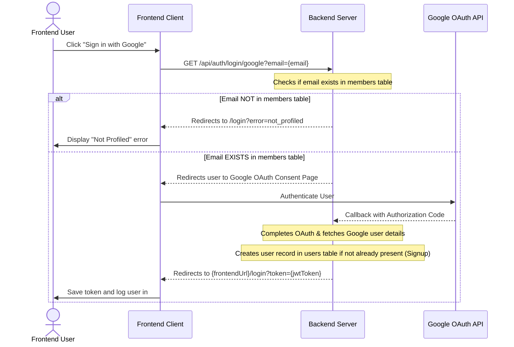

# API Documentation & Frontend Integration Guide

This directory contains endpoint definitions, architectural guides, and `.http` test files for the Heritage MMC backend.

## 1. How to Run the REST Requests
Execute these requests directly in your IDE using:
* **VS Code**: [REST Client](https://marketplace.visualstudio.com/items?itemName=humao.rest-client)
* **IntelliJ / WebStorm / GoLand**: Built-in HTTP Client support.

Available test scripts:
- [`auth.http`](file:///Users/mac/Desktop/HeritageSuperApp/church-backend/api_docs/auth.http): Authentication, Google OAuth, and profile testing.
- [`email.http`](file:///Users/mac/Desktop/HeritageSuperApp/church-backend/api_docs/email.http): Email notification dispatcher and live SMTP delivery testing.

---

## 2. Authentication & Leadership Onboarding

The backend uses a centralized authentication and role-gated access model.

### A. Admin / Local Login (Email & Password)
* **Endpoint**: `POST /api/auth/login`
* **Request Body**:
  ```json
  {
    "email": "admin@hofchurch.org",
    "password": "Password123@"
  }
  ```
* **Response**: Returns JWT token, user roles, church affiliation, and permissions.

---

### B. Google OAuth & Auto-Registration Flow
Public signups are restricted. Only pre-profiled church members or invited leaders can authenticate via Google:



---

### C. Leadership Magic Link & Account Claim Flow
Super Admins can invite branch pastors and church admins. Upon invite creation, the backend automatically generates a single-use token and delivers a branded **Account Approved** magic link email.

* **Endpoint**: `POST /api/super-admin/leadership/invite`
* **Request Body**:
  ```json
  {
    "email": "pastor.david@hofchurch.org",
    "first_name": "David",
    "last_name": "Olukayode",
    "role": "resident_pastor",
    "church_id": "97e6822c-a2b1-4f10-91de-001234567890"
  }
  ```
* **Magic Link Destination**:
  `{FRONTEND_URL}/auth/magic-login?code={otp_code}&email={email}`

---

## 3. Email Notification & Dispatch System

The backend features an integrated Go SMTP transport layer and responsive HTML email rendering engine using `html/template` and `//go:embed`.

### A. Environment Configuration (`.env`)
```env
SMTP_HOST="smtp.gmail.com"
SMTP_PORT="587"
SMTP_USER="your-email@gmail.com"
SMTP_PASS="your-16-char-app-password"
SMTP_FROM_EMAIL="your-email@gmail.com"
SMTP_FROM_NAME="Heritage MMC"
```

### B. Live Email Testing & Manual Dispatch Endpoint
Super Admins can test any of the 10 email templates directly from the frontend UI (`/super-admin/settings`) or via REST API.

* **Endpoint**: `POST /api/super-admin/email/send-test`
* **Headers**: `Authorization: Bearer <SUPER_ADMIN_JWT>`
* **Request Body**:
  ```json
  {
    "template": "magic_link",
    "to_email": "josepholukayode05@gmail.com",
    "name": "Pastor Joseph"
  }
  ```
* **Response**:
  ```json
  {
    "success": true,
    "message": "Test email for 'magic_link' sent successfully to josepholukayode05@gmail.com"
  }
  ```

### C. Supported Email Templates & Keys

| Template Key | Workflow / Purpose | Sample Trigger Data |
| :--- | :--- | :--- |
| `magic_link` | Account Approved & Leadership Onboarding | Recipient name, role, action URL, center |
| `birthday` | Member Birthday Greeting & Pastoral Blessing | Member name, scripture verse & ref, pastor blessing |
| `otp` | Two-Factor / Security Verification Code | 6-digit PIN, purpose, expiry minutes, IP address |
| `welcome_visitor` | First-Timer / Soul Welcome & Follow-Up | Visitor name, service attended, next service time |
| `new_member_welcome` | Official Member Portal Registration | Member name, Member ID (`HOF-2026-XXXX`), portal link |
| `anniversary` | Wedding & Milestone Anniversary | Couple names, years celebrating, scripture blessing |
| `team_assignment` | Ministry Unit / Department Assignment | Member name, team name, role, leader contact, schedule |
| `event_reminder` | Program, Conference & Service Reminder | Event title, date, time, venue, live stream link |
| `donation_receipt` | Tithe & Kingdom Giving Receipt | Donor name, receipt #, formatted amount, transaction ref |
| `pastoral_care` | Pastoral Check-in & Prayer Support | Member name, pastoral note, prayer request URL |

---

## 4. Active Backend Routes Inventory

| Module | Route Prefix | Method | Endpoint | Auth / Permission |
| :--- | :--- | :--- | :--- | :--- |
| **Health** | `/api` | `GET` | `/health-check` | Public |
| **Auth** | `/api/auth` | `POST` | `/login` | Public |
| | | `GET` | `/login/google` | Public |
| | | `GET` | `/callback/google` | Public |
| | | `GET` | `/magic-link/verify` | Public |
| | | `POST` | `/magic-link/claim` | Public |
| | | `GET` | `/me` | Bearer Token |
| **Profile** | `/api/profile` | `GET`, `PUT` | `/me` | Bearer Token |
| | | `GET`, `POST` | `/me/kids` | Bearer Token |
| | | `PUT`, `DELETE`| `/me/kids/:kidID` | Bearer Token |
| | | `GET` | `/:userID` | Bearer Token |
| **Super Admin** | `/api/super-admin`| `GET`, `POST`| `/churches` | Super Admin |
| | | `PUT` | `/churches/:id` | Super Admin |
| | | `POST` | `/churches/:id/reassign-leadership` | Super Admin |
| | | `POST` | `/churches/:id/toggle-status` | Super Admin |
| | | `GET` | `/leadership/invites` | Super Admin |
| | | `POST` | `/leadership/invite` | Super Admin (Triggers Email) |
| | | `DELETE` | `/leadership/invites/:id` | Super Admin |
| | | `GET` | `/audit-logs` | Super Admin |
| | | `GET`, `PUT` | `/settings` | Super Admin |
| | | `GET`, `PUT` | `/settings/permissions` | Super Admin |
| | | `GET` | `/settings/diagnostics` | Super Admin |
| | | `GET`, `PUT` | `/settings/churches/:id` | Super Admin |
| | | `POST` | `/email/send-test` | Super Admin (Live SMTP Test) |
| **General Overseer**| `/api/go` | `GET` | `/members/search` | General Overseer |
| | | `GET` | `/members/:id/360-dossier` | General Overseer |
| **Analytics** | `/api/analytics` | `GET` | `/executive-summary` | Executive / Super Admin |
| **Members** | `/api/members` | `GET`, `POST`| `/` | Branch Admin / Leader |
| | | `GET`, `PUT`, `DELETE` | `/:id` | Branch Admin / Leader |
| **Teams** | `/api/teams` | `GET`, `POST`| `/` | Bearer Token |
| | | `GET`, `PUT`, `DELETE` | `/:id` | Bearer Token |
| **Sectors** | `/api/sectors` | `GET`, `POST`| `/` | Bearer Token |
| | | `GET`, `PUT`, `DELETE` | `/:id` | Bearer Token |
| **Souls** | `/api/souls` | `GET`, `POST`| `/` | Bearer Token |
| | | `GET`, `PATCH`, `DELETE` | `/:id` | Bearer Token |
| | | `GET`, `POST`| `/:id/journal` | Bearer Token |
| **Follow-Up** | `/api/follow-up` | `GET`, `POST`| `/` | Bearer Token |
| | | `GET`, `PATCH`, `DELETE` | `/:id` | Bearer Token |
| **Transport** | `/api/transportation` | `GET`, `POST`| `/` | Bearer Token |
| | | `GET`, `PATCH`, `DELETE` | `/:id` | Bearer Token |
| **Dashboard** | `/api/dashboard` | `GET` | `/admin` | Bearer Token |
