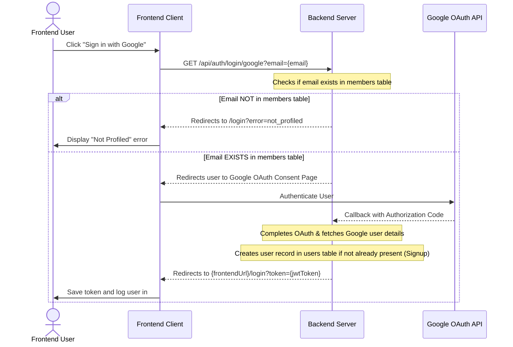

# API Documentation & Frontend Integration Guide

This directory contains endpoint definitions for testing and integrating with the Go modular monolith backend.

## 1. How to Run the REST Requests
The file [auth.http](file:///Users/mac/Desktop/HeritageSuperApp/church-backend/api_docs/auth.http) uses the standard HTTP format. You can execute these requests directly inside your IDE using extensions like:
* **VS Code**: [REST Client](https://marketplace.visualstudio.com/items?itemName=humao.rest-client)
* **IntelliJ / WebStorm**: Built-in HTTP Client support.

Simply update `@authToken` in [auth.http](file:///Users/mac/Desktop/HeritageSuperApp/church-backend/api_docs/auth.http) with the JWT token received from a login response to test the protected endpoints.

---

## 2. Authentication & Signup Flows

The backend uses a single sign-on model where authentication is centralized under the `auth` module.

### A. Admin / Local Login (Email & Password)
Used for administrative testing or system credentials.

* **Endpoint**: `POST /api/auth/login`
* **Request Body**:
  ```json
  {
    "email": "admin@hofchurch.org",
    "password": "Password123@"
  }
  ```
* **Response**: Returns a JSON object containing the JWT token, email, and user roles.

---

### B. Google OAuth & Auto-Registration (Signup) Flow
The application **does not** allow random public signups. Users can only register if they are pre-profiled (registered in the church members database).



#### Step-by-Step Implementation:
1. **Initiate Sign-In**:
   The frontend must redirect the browser to the backend OAuth initiation endpoint:
   ```http
   GET http://localhost:8080/api/auth/login/google?email=user_email@gmail.com
   ```
2. **Backend Validation & Redirection**:
   * If the email is **not profiled**, the backend redirects the browser back to:
     `{FRONTEND_URL}/login?error=not_profiled`
   * If the email **is profiled**, the backend initiates the Google OAuth sequence, redirecting the browser to Google's authentication page.
3. **Capture Token on Frontend**:
   After the user logs into Google, the backend processes the callback and redirects the browser back to the frontend with the authorization token as a query parameter:
   ```
   {FRONTEND_URL}/login?token=eyJhbGciOiJIUzI1NiIsInR5cCI6...
   ```
   Your frontend router must listen on the `/login` route, extract the `token` parameter from the URL, store it in local storage/cookies, and redirect the user to the dashboard.

---

## 3. Consuming Protected Routes
For any endpoint marked with `(Admin gated)` or `requireAuth` in the Go code, you must include the token in the `Authorization` header as a Bearer token:

```http
GET /api/profile/me
Authorization: Bearer <your_jwt_token>
Accept: application/json
```

---

## 4. Backend Logging System (Development & Production)
The backend logs all incoming API requests and outgoing responses for debugging and auditing.

### Request & Response Payload Logging
- **Log Location**: Writes structured JSON data to `app.log` in the backend root directory and mirrors logs to `stdout`.
- **Logged Properties**:
  - `timestamp`: RFC3339 time format
  - `client_ip`: The IP address of the request origin
  - `method` & `uri`: HTTP Verb and request path
  - `status`: HTTP response status code
  - `latency_ms`: Duration of request processing in milliseconds
  - `request_body`: The JSON payload sent by the client. Sensitive fields (`password`, `password_hash`, `token`) are automatically replaced with `[REDACTED]`.
  - `response_body`: The JSON payload returned by the server.
  - `error`: Populated with the error message if the handler fails.

### JWT Claims Verification Logs
When a request hits a protected endpoint, the `RequireAuth` middleware prints a console log upon successful token verification containing:
```
[RequireAuth] Claims verified - UserID: <id>, Email: <email>, Roles: <roles>
```

---

## 5. Summary of Active Backend Modules & Routes

Below is the complete inventory of active routes registered in `cmd/server/main.go`:

| Module | Route Prefix | HTTP Method | Path | Auth / Role Requirement |
| :--- | :--- | :--- | :--- | :--- |
| **Health** | `/api` | `GET` | `/health-check` | Public |
| **Auth** | `/api/auth` | `POST` | `/login` | Public |
| | | `GET` | `/login/google` | Public |
| | | `GET` | `/callback/google` | Public |
| | | `GET` | `/me` | Bearer Token |
| **Profile** | `/api/profile` | `GET` | `/me` | Bearer Token |
| | | `PUT` | `/me` | Bearer Token |
| | | `GET` | `/me/kids` | Bearer Token |
| | | `POST` | `/me/kids` | Bearer Token |
| | | `PUT` | `/me/kids/:kidID` | Bearer Token |
| | | `DELETE` | `/me/kids/:kidID` | Bearer Token |
| | | `GET` | `/:userID` | Bearer Token (Any Role) |
| **Users** | `/api/users` | `GET` | `/` | Bearer Token |
| **Members** | `/api/members` | `GET` | `/` | Bearer Token + (`team_lead`, `resident_pastor`, `church_admin`) |
| | | `GET` | `/:id` | Bearer Token + (`team_lead`, `resident_pastor`, `church_admin`) |
| | | `POST` | `/` | Bearer Token + (`team_lead`, `resident_pastor`, `church_admin`) |
| | | `POST` | `/profile` | Bearer Token + (`team_lead`, `resident_pastor`, `church_admin`) |
| | | `PUT` | `/:id` | Bearer Token + (`team_lead`, `resident_pastor`, `church_admin`) |
| | | `DELETE` | `/:id` | Bearer Token + (`team_lead`, `resident_pastor`, `church_admin`) |
| **Teams** | `/api/teams` | `GET`, `POST` | `/` | Bearer Token |
| | | `GET`, `PUT`, `DELETE` | `/:id` | Bearer Token |
| **Sectors** | `/api/sectors` | `GET`, `POST` | `/` | Bearer Token |
| | | `GET`, `PUT`, `DELETE` | `/:id` | Bearer Token |
| **Churches** | `/api/churches` | `GET`, `POST` | `/` | Bearer Token |
| | | `GET`, `PUT`, `DELETE` | `/:id` | Bearer Token |
| **Souls** | `/api/souls` | `POST`, `GET` | `/` | Bearer Token |
| | | `GET`, `PATCH`, `DELETE` | `/:id` | Bearer Token |
| | | `POST`, `GET` | `/:id/journal` | Bearer Token |
| **Follow-Up** | `/api/follow-up` | `POST`, `GET` | `/` | Bearer Token |
| | | `GET`, `PATCH`, `DELETE` | `/:id` | Bearer Token |
| **Transport** | `/api/transportation` | `POST`, `GET` | `/` | Bearer Token |
| | | `GET`, `PATCH`, `DELETE` | `/:id` | Bearer Token |
| **Dashboard** | `/api/dashboard` | `GET` | `/admin` | Bearer Token |


